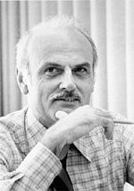

<table class="infobox biography vcard">
<tbody>
<tr>
<th colspan="2">

Edgar "Ted" Codd

</th>
</tr>
<tr>
<td colspan="2"></td>
</tr>
<tr>
<th scope="row">Born</th>
<td>

Edgar Frank Codd

 19 August 1923 

<a title="Fortuneswell" href="https://en.wikipedia.org/wiki/Fortuneswell">Fortuneswell</a>,&nbsp;<a title="Dorset" href="https://en.wikipedia.org/wiki/Dorset">Dorset</a>, England

</td>
</tr>
<tr>
<th scope="row">Died</th>
<td>18 April 2003&nbsp;(aged&nbsp;79) 

Williams Island,&nbsp;<a title="Aventura, Florida" href="https://en.wikipedia.org/wiki/Aventura,_Florida">Aventura, Florida</a>, USA

</td>
</tr>
<tr>
<th scope="row">Alma&nbsp;mater</th>
<td><a title="Exeter College, Oxford" href="https://en.wikipedia.org/wiki/Exeter_College,_Oxford">Exeter College, Oxford</a> <a title="University of Michigan" href="https://en.wikipedia.org/wiki/University_of_Michigan">University of Michigan</a></td>
</tr>
<tr>
<th scope="row">Known&nbsp;for</th>
<td><a class="mw-redirect" title="OLAP" href="https://en.wikipedia.org/wiki/OLAP">OLAP</a> <a title="Relational model" href="https://en.wikipedia.org/wiki/Relational_model">Relational model</a> <a title="Codd's cellular automaton" href="https://en.wikipedia.org/wiki/Codd%27s_cellular_automaton">Codd's cellular automaton</a> <a title="Codd's 12 rules" href="https://en.wikipedia.org/wiki/Codd%27s_12_rules">Codd's 12 rules</a> <a title="Boyce&ndash;Codd normal form" href="https://en.wikipedia.org/wiki/Boyce%E2%80%93Codd_normal_form">Boyce&ndash;Codd normal form</a></td>
</tr>
<tr>
<th scope="row">Awards</th>
<td><a title="Turing Award" href="https://en.wikipedia.org/wiki/Turing_Award">Turing Award</a>&nbsp;<small>(1981)</small></td>
</tr>
<tr>
<td colspan="2"><strong>Scientific career</strong></td>
</tr>
<tr>
<th scope="row">Fields</th>
<td class="category"><a class="mw-redirect" title="Computer Science" href="https://en.wikipedia.org/wiki/Computer_Science">Computer Science</a></td>
</tr>
<tr>
<th scope="row">Institutions</th>
<td><a title="University of Oxford" href="https://en.wikipedia.org/wiki/University_of_Oxford">University of Oxford</a> <a title="University of Michigan" href="https://en.wikipedia.org/wiki/University_of_Michigan">University of Michigan</a> <a class="mw-redirect" title="International Business Machines" href="https://en.wikipedia.org/wiki/International_Business_Machines">IBM</a></td>
</tr>
<tr>
<th scope="row"><a title="Thesis" href="https://en.wikipedia.org/wiki/Thesis">Thesis</a></th>
<td><a class="external text" href="http://search.proquest.com/docview/302172044" rel="nofollow"><em>Propagation, Computation, and Construction in Two-dimensional cellular spaces</em></a>&nbsp;(1965)</td>
</tr>
<tr>
<th scope="row"><a title="Doctoral advisor" href="https://en.wikipedia.org/wiki/Doctoral_advisor">Doctoral advisor</a></th>
<td><a title="John Henry Holland" href="https://en.wikipedia.org/wiki/John_Henry_Holland">John Henry Holland</a></td>
</tr>
</tbody>
</table>
 

<strong>Edgar Frank</strong>&nbsp;"<strong>Ted</strong>"&nbsp;<strong>Codd</strong>&nbsp;(19 August 1923 &ndash; 18 April 2003) was an English&nbsp;<a title="Computer science" href="https://en.wikipedia.org/wiki/Computer_science">computer scientist</a>&nbsp;who, while working for&nbsp;<a class="mw-redirect" title="International Business Machines" href="https://en.wikipedia.org/wiki/International_Business_Machines">IBM</a>, invented the&nbsp;<a title="Relational model" href="https://en.wikipedia.org/wiki/Relational_model">relational model</a>&nbsp;for&nbsp;<a title="Database" href="https://en.wikipedia.org/wiki/Database">database</a>&nbsp;management, the theoretical basis for&nbsp;<a title="Relational database" href="https://en.wikipedia.org/wiki/Relational_database">relational databases</a>&nbsp;and&nbsp;<a class="mw-redirect" title="Relational database management system" href="https://en.wikipedia.org/wiki/Relational_database_management_system">relational database management systems</a>. He made other valuable contributions to&nbsp;<a title="Computer science" href="https://en.wikipedia.org/wiki/Computer_science">computer science</a>, but the relational model, a very influential general theory of data management, remains his most mentioned, analyzed and celebrated achievement.

 

<h2> Publications </h2>
<ul>
 <li><a target="_blank" href="https://github.com/manjunath5496/Edgar-F-Codd-Papers/blob/master/cod(1).pdf" style="text-decoration:none;">Relational Database: A Practical Foundation for Productivity</a></li>
  
<li><a target="_blank" href="https://github.com/manjunath5496/Edgar-F-Codd-Papers/blob/master/cod(2).pdf" style="text-decoration:none;">A Relational Model of Data for Large Shared Data Banks</a></li>  
  
<li><a target="_blank" href="https://github.com/manjunath5496/Edgar-F-Codd-Papers/blob/master/cod(3).pdf" style="text-decoration:none;">Data Models In Database Management</a></li>
                               
 <li><a target="_blank" href="https://github.com/manjunath5496/Edgar-F-Codd-Papers/blob/master/cod(4).pdf" style="text-decoration:none;">Relational Completeness Of Data Base Sublanguages</a></li>                              
<li><a target="_blank" href="https://github.com/manjunath5496/Edgar-F-Codd-Papers/blob/master/cod(5).pdf" style="text-decoration:none;"> Extending the Database Relational Model to Capture More Meaning </a></li>
 <li><a target="_blank" href="https://github.com/manjunath5496/Edgar-F-Codd-Papers/blob/master/cod(6).pdf" style="text-decoration:none;">Derivability, Redundancy and Consistency of Relations Stored in Large Data Banks </a></li>
                <li><a target="_blank" href="https://github.com/manjunath5496/Edgar-F-Codd-Papers/blob/master/cod(7).rar" style="text-decoration:none;">The Relational Model for Database Management: Version 2  </a></li>                                
         
 <li><a target="_blank" href="https://github.com/manjunath5496/Edgar-F-Codd-Papers/blob/master/cod(8).pdf" style="text-decoration:none;">Providing OLAP to User-Analysts: An IT Mandate</a></li>
  
<li><a target="_blank" href="https://github.com/manjunath5496/Edgar-F-Codd-Papers/blob/master/cod(9).pdf" style="text-decoration:none;">Codd's First Papers - a critical analysis</a></li>  
  
<li><a target="_blank" href="https://github.com/manjunath5496/Edgar-F-Codd-Papers/blob/master/cod(10).pdf" style="text-decoration:none;">Cellular Automata</a></li>
                               
 <li><a target="_blank" href="https://github.com/manjunath5496/Edgar-F-Codd-Papers/blob/master/cod(11).pdf" style="text-decoration:none;">Codd's 12 Rules</a></li>   

</ul>
